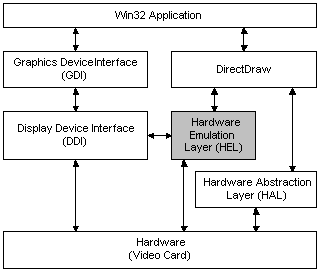
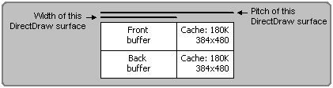

MSSDK\INCLUDE
MSSDK\LIB

Windows 10 SDK안에 포함되어 있다.
C:\Program Files (x86)\Windows Kits\10\Include\10.0.19041.0\um\ddraw.h
ddraw.h

ddraw.lib
dxguid.lib





outputdebugstring - https://docs.microsoft.com/en-us/windows/win32/api/debugapi/nf-debugapi-outputdebugstringa?redirectedfrom=MSDN
``` txt
 Display memory:
+--------------------------+-------------+
|                          |             |
| -- screen width -------- |             |
|                          |             |
| -- pitch/stride ---------------------- |
|                          |             |
|                          |             |
|                          |             |
|                          |             |
|                          |             |
+--------------------------+-------------+
```


Create a new project > [C++] Windows Desktop Application

C/C++ > Precompiled Headers

stdafx.h / stdafx.cpp
Standard Application Framework
=> .pch (PreCompiled Header)


C/C++  > General > Additional Include Directories
Linker > General > Additional Library Directories
Linker > Input > Additional Dependencies
#pragma comment(lib, "dxguid.lib")
#pragma comment(lib, "ddraw.lib")

HWND (Handle WiNDow)
CWnd (Class WiNDow)

``` cpp
// ddraw.h
struct IDirectDraw;
struct IDirectDrawSurface;
struct IDirectDrawPalette;
struct IDirectDrawClipper;

typedef struct IDirectDraw              FAR *LPDIRECTDRAW;
typedef struct IDirectDraw7             FAR *LPDIRECTDRAW7;
typedef struct IDirectDrawSurface       FAR *LPDIRECTDRAWSURFACE;
typedef struct IDirectDrawSurface7      FAR *LPDIRECTDRAWSURFACE7;
typedef struct IDirectDrawPalette               FAR *LPDIRECTDRAWPALETTE;
typedef struct IDirectDrawClipper               FAR *LPDIRECTDRAWCLIPPER;
typedef struct IDirectDrawColorControl          FAR *LPDIRECTDRAWCOLORCONTROL;
typedef struct IDirectDrawGammaControl          FAR *LPDIRECTDRAWGAMMACONTROL;
```

``` cpp
// dvp.h
typedef struct IDirectDrawVideoPort             FAR *LPDIRECTDRAWVIDEOPORT;
```

UNREFERENCED_PARAMETER() // C4100 - unreferenced formal parameter 무시
    LoadStringW(hInstance, IDS_APP_TITLE, szTitle, MAX_LOADSTRING); // - Resource View(Ctrl + Shift + E)에서 확인가능
    
    //http://www.soen.kr/lecture/win32api/lec5/lec5-4-0.htm
    // LoadAccelerators
    //TranslateAccelerator
액셀러레이터(Accelerator)는 아주 쉽게 말해서 단축키이다. 아래 한글을 예로 든다면 Alt+L을 누르면 문자 꾸미기 기능, Ctrl+P를 누르면 프린터 설정 기능이 곧바로 실행되도록 하는 키보드 조합키를 말한다


// 
``` cpp
#include <crtdbg.h>

#ifdef _DEBUG
  _CrtSetDbgFlag(_CRTDBG_ALLOC_MEM_DF | _CRTDBG_LEAK_CHECK_DF);

// _CRTDBG_ALLOC_MEM_DF  - 디버그모드에서 메모리 할당이 일어날 때 마다 추적한다.
// _CRTDBG_LEAK_CHECK_DF - 프로그램이 종료되기 전에 자동으로 _CrtDumpMemoryLeaks() 함수를 호출하여 메모리를 할당한 후 해제 하지 않는 메모리가 있는지 확인한다.
#endif // _DEBUG

// blabla

#ifdef _DEBUG
  _ASSERT(_CrtCheckMemory());
#endif // _DEBUG
```

``` cpp
#ifdef _DEBUG
__debugbreak();
#endif // _DEBUG
```


|                    |     |
| ------------------ | --- |
| IDirectDraw        |     |
| IDirectDrawSurface |     |
| IDirectDrawPalette |     |
| IDirectDrawClipper |     |

DirectDraw / DDraw
DirectDraw : Video 메모리에 접근


CPU -> DDraw Api
                 <- Read  <-------------  System Memory[Write Combine] <- Driver <- Graphic Card
                 -> Write -> WC Buffer -> System Memory[Write Combine] -> Driver -> Graphic Card

읽기시도 | WC메모리는 캐시되지 않음                |  느림
쓰기시도 | WC Buffer를 이용하기에 캐시 효과가 있음 | 빠름

https://megayuchi.com/2021/06/06/ddraw-surface-d3d-dynamic-buffer-%ec%97%90%ec%84%9c%ec%9d%98-write-combine-memory/


0번 압축 - https://www.gpgstudy.com/forum/viewtopic.php?t=2455


COM Component Object Model

|                  | ref |
| ---------------- | --- |
| AddRef()         | ++  |
| Release()        | --  |
| QueryInterface() | ++  |


GDI Graphics Device Interface

| GDI Object |     |     |
| ---------- | --- | --- ||
| Bitmap              |     | HBITMAP    |
| Brush               |     | HBRUSH     |
| DC - Device Context |     | HDC handle |


DirectDraw 프로그래밍 소개
https://www.youtube.com/watch?v=J0MNKUYw1zY
https://github.com/megayuchi/PixelHorizon


DirectX version 8.0, DirectDraw was merged into a new package called DirectX Graphics
June 2010, DirectDraw was removed from the DirectX SDK package
in 2012, the DirectX SDK was merged into the Windows Platform SDK, and DirectDraw was included once again.
Direct2D from DirectX11
  GDI계열에서 CPU에 의존하던 처리를 GPU에 분산하여 빠르게 동작. COM 런타임을 사용하지 않음.


IDirectDraw7
IDirectDrawClipper
IDirectDrawSurface7
IDirectDrawPalette
IDirectDrawVideoPort

LPDIRECTDRAW == IDirectDraw*

if (::DirectDrawCreate(nullptr, &m_pDDraw, nullptr) != DD_OK)
{
  MessageBox(hWnd, L"Fail to Create DirectDraw", L"Error", MB_OK);
  goto lb_return;
}

if (m_pDDraw->QueryInterface(IID_IDirectDraw7, (LPVOID*)&m_pDDraw7) != DD_OK)
{
  MessageBox(hWnd, L"Fail to Create DirectDraw 4", L"Error", MB_OK);
  goto lb_return;
}

flip / Double buffering / Swap chain


IDirectDrawSurface7 하드웨어 대응 2D 버퍼
기본 width * height * bytes per pixel
하드웨어 (width + extra) * height * bytes per pixel
pitch
 - y축 이동하기 위한 간격
 - width * bytes per pixel과 같을 수도 아닐 수 도 있다(아니라고 생각하는게 실수 막는데 좋음)
 - https://docs.microsoft.com/en-us/windows/win32/direct3d9/width-vs--pitch


``` cpp
pDDBack->Lock
// 작업
pDDBack->Unlock
pDDPrimary->Blt
```

DirectDrawCreate   |
DirectDrawCreateEx | supports the set of Direct3D interfaces in DirectX 7.0

draw1 -> draw7
front buffer 화면에 보일 / back buffer 작업할 버퍼 준비

``` cpp

char* pSrc = pBits + (ivSrcStart.x + ivSrcStart.y * iBitmapWidth) * 4;
char* pDest = m_pLockedBackBuffer + (ivDestStart.x * 4) + ivDestStart.y * m_dwLockedBackBufferPitch;

for (int y = 0; y < ivDestSize.y; y++)
{
    for (int x = 0; x < ivDestSize.x; x++)
    {
        *(DWORD*)pDest = *(DWORD*)pSrc;
        pSrc += 4;
        pDest += 4;
    }
    pSrc -= (ivDestSize.x * 4);
    pSrc += (iBitmapWidth * 4);
    pDest -= (ivDestSize.x * 4);
    pDest += m_dwLockedBackBufferPitch;
}
```
  
# direct2D
MFC에 포함되어있음

- https://docs.microsoft.com/en-us/windows/win32/direct2d/direct2d-portal

D2D1 - (Direct2D v1)

https://www.slideshare.net/jacking/0602-direct2d


``` cpp
IDirectDraw*            m_pDDraw;
IDirectDraw7*           m_pDDraw7;
IDirectDrawSurface7*    m_pDDPrimary;
IDirectDrawSurface7*    m_pDDBack;
IDirectDrawClipper*     m_pClipper;
```


Learn Computer Game Programming with DirectX 7.0 by Ian Parberry
Tricks of the Windows Game Programming Gurus
 7-2 double buffering


 https://www.gamedev.net/forums/topic/3962-fullscreen-blit-or-flip/
 Flipping is always faster than blitting when surfaces are in video memory. If for some reason your surfaces are in system memory then on all video cards (except ones with dma ram to vram coping) blitting is faster than flipping and a simple mmx copy loop is the fastest method (only if you have no hardware support for sysmem surfaces).


https://woo-dev.tistory.com/206


windowed

``` cpp
// blit

// primary
DDSURFACEDESC2 ddsd = {}; // DirectDrawSurfaceDescription
ddsd.dwSize = sizeof(DDSURFACEDESC2);
ddsd.dwFlags = DDSD_CAPS;
ddsd.ddsCaps.dwCaps = DDSCAPS_PRIMARYSURFACE;


// back
DDSURFACEDESC2 ddsd = {};
ddsd.dwSize = sizeof(DDSURFACEDESC2);
ddsd.dwFlags = DDSD_CAPS | DDSD_WIDTH | DDSD_HEIGHT;
ddsd.ddsCaps.dwCaps = DDSCAPS_OFFSCREENPLAIN | DDSCAPS_SYSTEMMEMORY;
ddsd.dwWidth = width;
ddsd.dwHeight = height;
```
  
fullscreen

``` cpp
// flip
SetCooperativeLevel(g_hMainWnd, DDSCL_EXCLUSIVE | DDSCL_FULLSCREEN);

// ref : https://docs.microsoft.com/en-us/windows/win32/api/ddraw/nf-ddraw-idirectdraw7-setcooperativelevel
// |                       |                                                                                                           |
// | --------------------- | --------------------------------------------------------------------------------------------------------- |
// | DDSCL_NORMAL          | 일반적인 Windows 창에서 프로그램이 가능                                                                   |
// | DDSCL_ALLOWMODEX      | ModeX(해상도 : 320 × 320, 320 × 400)를 지원                                                               |
// | DDSCL_ALLOWREBOOT     | 전체 화면시 Ctrl + Alt + Del key 가능                                                                     |
// | DDSCL_NOWINDOWCHANGES | 활성화 된 프로그램의 Windows 창 변경이 불가능                                                             |
// | DDSCL_EXCLUSIVE       | 해상도를 바꾸거나 flipping 작업을 할 때 사용 DDSCL_FULLSCREEN GDI를 사용하지 않는 전체화면 모드 사용 가능 |

SetCooperativeLevel(m_hwnd, DDSCL_EXCLUSIVE | DDSCL_FULLSCREEN | DDSCL_ALLOWMODEX | DDSCL_ALLOWREBOOT );
SetCooperativeLevel(m_hwnd, DDSCL_EXCLUSIVE | DDSCL_FULLSCREEN | DDSCL_ALLOWREBOOT );

// primary 2
DDSURFACEDESC2 ddsd = {};
// ref: https://docs.microsoft.com/en-us/previous-versions/windows/hardware/drivers/ff550340(v=vs.85)
// | ddsd.dwFlags         |
// | -------------------- |
// | DDSD_ALPHABITDEPS    |
// | DDSD_BACKBUFFERCOUNT |
// | DDSD_CAPS            |
// | DDSD_CKDESTBLT       |
// | DDSD_CKDESTOVERLAY   |
// | DDSD_CKSRCBLT        |
// | DDSD_CKSRCOVERLAY    |
// | DDSD_HEIGHT          |
// | DDSD_LINEARSIZE      |
// | DDSD_LPSURFACE       |
// | DDSD_MIPMAPCOUNT     |
// | DDSD_PITCH           |
// | DDSD_PIXELFORMAT     |
// | DDSD_REFRESHRATE     |
// | DDSD_TEXTURESTAGE    |
// | DDSD_WIDTH           |
ddsd.dwSize = sizeof(DDSURFACEDESC2);
ddsd.dwFlags = DDSD_CAPS | DDSD_BACKBUFFERCOUNT;
ddsd.ddsCaps.dwCaps = DDSCAPS_PRIMARYSURFACE | DDSCAPS_FLIP | DDSCAPS_COMPLEX;
ddsd.ddsCaps.dwCaps |= DDSCAPS_3DDEVICE; // 3d support
// ref: https://docs.microsoft.com/en-us/previous-versions/windows/hardware/drivers/ff550286(v=vs.85)
//  | DDSCAPS structure      |                                                                                                |
//  | ---------------------- | ---------------------------------------------------------------------------------------------- |
//  | DDSCAPS_BACKBUFFER     | 이 표면이 표면 플리핑 구조체의 백 버퍼임을 나타냅니다.                                         |
//  | DDSCAPS_COMPLEX        | 이 표면이 플리핑 체인을 만들기 위해 기본 표면과 하나 이상의 백버퍼를 가지고 있음을 나타냅니다. |
//  | DDSCAPS_FLIP           | 이 표면이 표면 플리핑 구조체의 일부임을 나타냅니다.                                            |
//  | DDSCAPS_OFFSCREENPLAIN | 이 표면이 그리기 위한 화면 표면이 아님을 나타냅니다.                                           |
//  |                        | 주로 스프라이트 이미지를 미리 불러와 저장해두는 창고의 의미가 강한 표면 속성입니다.            |
//  | DDSCAPS_PRIMARYSURFACE | 이 표면이 기본 표면임을 나타냅니다.                                                            |
//  |                        | 이 표면은 실제 사용자에게 보여지는 표면입니다.                                                 |
//  | DDSCAPS_SYSTEMMEMORY   | 이 표면의 메모리가 시스템 메모리 상에 할당 되어 있음을 나타냅니다.                             |
//  | DDSCAPS_VIDEOMEMORY    | 이 표면이 그래픽카드의 VRAM 상에 존재함을 나타냅니다.                                          |
ddsd.dwBackBufferCount = 2;
pDDraw7->CreateSurface(&ddsd, &pDDPrimary, nullptr);

DDSCAPS_FLIP
DDSCAPS_COMPLEX
DDSCAPS_3DDEVICE

// back
DDSURFACEDESC2 ddsd = {};
ddsd.dwSize = sizeof(DDSURFACEDESC2);
ddsd.dwFlags = DDSCAPS_BACKBUFFER;
pDDPrimary->GetAttachedSurface(&ddsd, &pddBack);
```

``` cpp
DDSCAPS2 ddsd;
ZeroMemory(&ddsd, sizeof(DDSCAPS2));
ddsd.dwCaps = DDSCAPS_VIDEOMEMORY | DDSCAPS_LOCALVIDMEM;

DWORD totalMem;
DWORD freeMem;
pDDraw7->GetAvailableVidMem(&ddsd, &totalMem, &freeMem);
```

https://slideplayer.com/slide/8556698/
https://www.codeproject.com/Articles/2370/Introduction-to-DirectDraw-and-Surface-Blitting


DirectDrawCreateEx  - 3d기능까지 이용하려면


http://telnet.or.kr/sec_directx/ directx9 chm

[수정] DirectDraw에서 윈도우 모드에서 Flip이 불가능한 이유는 뭔가요?
https://throwbug.com/2056/%EC%88%98%EC%A0%95-directdraw%EC%97%90%EC%84%9C-%EC%9C%88%EB%8F%84%EC%9A%B0-%EB%AA%A8%EB%93%9C%EC%97%90%EC%84%9C-flip%EC%9D%B4-%EB%B6%88%EA%B0%80%EB%8A%A5%ED%95%9C-%EC%9D%B4%EC%9C%A0%EB%8A%94-%EB%AD%94%EA%B0%80%EC%9A%94

DirectX 게임 데모 프로그래밍
http://1st.gamecodi.com/board/zboard.php?id=GAMECODILAB_QnA_etc&page=1&sn1=&divpage=1&sn=on&ss=on&sc=on&keyword=directdraw&select_arrange=last_comment&desc=asc&no=426


fullscreen "ㅘ면복구
IDirectDrawSurface::Restore 이용

```
https://blog.naver.com/stweed/30013846901
https://blog.naver.com/stweed/30013850874

-15장#1- 알아두면 좋은 것들!!! 
1. 잃어버린 화면 복구하기

 

풀 스크린 모드에서 실행할 때, Alt+Tab키 사용이나 Ctrl+Esc 키 사용 등으로 인해서

윈도우 화면으로 넘어갔다가(최소화 되었다가) 다시 게임으로 돌아올 경우

검은색 화면만 나오게 된다.

Flip()은 주표면과 보조표면의 주소를 바꾼다고 설명한 적이 있다.

즉, 주표면이 축소되면서 주표면의 주소를 잃어버려 보조표면을 어디로 찍어야 할지를

모르는 것이다. 그래서 화면이 검은색으로 나오는 것이다.

 

화면을 복구하기 위해서는 IDirectDrawSurface7::Restore() 함수를 사용해서 잃어버린

주표면의 주소를 복구해 주면 된다. < g_lpPrimaryDDS->Restore() >

하지만, 이렇게 단순히 주표면의 주소만 복구해 주는 방법을 쓸 경우에는 리소스(이미지)들을

로드한 오프스크린(서피스)들이 시스템 메모리에 생성이 되어 있어야 한다.

비디오 메모리에 생성이 된 오프스크린들은 다시 리소스들을 로드해 줘야 한다.

 

주표면이 주소를 잃어 버렸는지 검사하는 방법은 플립할 때 리턴값을 조사하면 된다.

플립이 성공하면 DD_OK를 반환하고, 주소를 잃을 경우 DDERR_SURFACELOST 를

반환하므로 아래와 같이 조사하면 될 것이다.

 

if( g_lpPrimaryDDS->Flip(0, DDFLIP_WAIT) == DDERR_SURFACELOST )

{

    g_lpPrimaryDDS->Restore();

   //이 곳에 비디오 메모리에 생성된 서피스들에 대해서만,

   // 다시 이미지를 로드해 주면 되겠지요?

}                     

또는

if( g_lpPrimaryDDS->Flip(0, DDFLIP_WAIT) != DD_OK )

{

    g_lpPrimaryDDS->Restore();

   //이 곳에 비디오 메모리에 생성된 서피스들에 대해서만,

   // 다시 이미지를 로드해 주면 되겠지요?

} 

 

 

2. 초당 프레임(FPS) 알아내기

 

원래 FPS(초당 프레임)란 뜻은, 동영상이나 필름의 프레임 화면이 바뀌는 속도를 초 단위로

나타내는 것이었다.

게임에서도 비슷한 뜻이지만, 초당 게임루프가 몇 번 실행되는 것인가?가 더 어울린다.

따라서 게임내에서 FPS를 구하는 방법은,

처음 게임루프가 실행되었던 시간(nLastTime)과 현재 게임루프가 시작되는 시간(nTime)의

차이가 1초이상이 되었을 때, 게임루프의 실행횟수(nFrames)를 시간차(nTime-nLastTime)

로 나누어서 구하면 될 것이다.

아래에 있는 예제 소스는, FPS(초당 프레임)을 구해서 int형으로 반환해 주는 함수이다.

----------------------------------------------------------------------------

int GetFPS()
{
    static int nFPS = 0;
    static int nLastTime = 0;  //처음 게임루프가 실행되었던 시간 
    static int nFrames   = 0;  //게임 루프가 돌아가는 횟수 

    int  nTime = timeGetTime()/1000;

    ++nFrames;
    if(nTime-nLastTime > 1)
    {
       nFPS = nFrames / (nTime-nLastTime);
        nLastTime = nTime;
        nFrames = 0;
    }
 return nFPS;
}

---------------------------------------------------------------------------------

당연히 , 위 함수는 게임이 실질적으로 수행되는 게임루프안에서 호출되어야 한다.

 

 

3. 시스템 메모리/비디오 메모리 정보(사용량) 알아내기

 

첫 번째, 시스템 메모리(RAM) 정보를 알아내는 것은 Win32 API에서 지원하는

MEMORYSTATUS 구조체와 GlobalMemoryStatus()함수를 사용하여 알아 낼수 있다.

방법은 아래와 같다.

----------------------------------------------------------------------------

//DIVIDE_NUM 은 #define  DIVIDE_NUM    (1024*1024) 로 재정의 되어있다.

//DWORD  g_dwTotalMem, g_dwFreeMem, g_dwUseMem ;

 

MEMORYSTATUS MemStatus;

ZeroMemory(&MemStatus,sizeof(MEMORYSTATUS)); //초기화
MemStatus.dwLength = sizeof(MEMORYSTATUS);     //구조체 크기를 대입
GlobalMemoryStatus(&MemStatus);                          
 

//총 RAM  
g_dwTotalMem = MemStatus.dwTotalPhys/DIVIDE_NUM ; 

//남은 RAM 

g_dwFreeMem = MemStatus.dwAvailPhys/DIVIDE_NUM ;

//사용중인 RAM 
g_dwUseMem =  g_dwTotalMem - g_dwFreeMem ;

------------------------------------------------------------------------------

GlobalMemoryStatus()함수로 얻어온, 시스템 메모리에 대한 값들은 Byte단위 이므로,

보기 편한 메가바이트(Mega Byte)단위로 바꾸기 위해서 DIVIDE_NUM 로 나누어 주었다.

 

두 번째, 비디오 메모리(VRAM) 정보는 DirectDraw의 DDSCAP2 구조체와

GetAvailableVidMem() 함수를 사용해서 얻을 수 있다.

 

GetAvailableVidMem() 함수원형은 아래와 같다.

 HRESULT  GetAvailableVidMem(LPDDSCAPS2  lpDDSCaps2,  //DDSCAP2의 포인터

                LPDWORD lpdwTotal,  //총 비디오 메모리값이 들어온다.

                LPDWORD lpdwFree); //남은 비디오 메모리값이 들어온다.

 

아래는 비디오 메모리를 구하는 코드이다.

------------------------------------------------------------------------------- 

//LPDIRECTDRAW7  g_lpDD=NULL;

//DWORD  g_dwTotalVRAM , g_dwFreeVRAM , g_dwUseVRAM  ;

 

DDSCAPS2  ddscaps ;
ZeroMemory(&ddscaps, sizeof(DDSCAPS2));

ddscaps.dwCaps = DDSCAPS_OFFSCREENPLAIN | DDSCAPS_VIDEOMEMORY |

                            DDSCAPS_LOCALVIDMEM ;
 

g_lpDD->GetAvailableVidMem(&ddscaps, &g_dwTotalVRAM, &g_dwFreeVRAM );

 

g_dwTotalVRAM = g_dwTotalVRAM/DIVIDE_NUM;       //총 VRAM 
g_dwFreeVRAM = g_dwFreeVRAM/DIVIDE_NUM;        //남은 VRAM
g_dwUseVRAM  = g_dwTotalVRAM-g_dwFreeVRAM;  //사용중인 VRAM

===============================================================================

 

오프스크린(서피스)들은 비디오 메모리나 시스템 메모리에 생성된다.

따라서, 비디오 메모리에 생성된 오프스크린들의 용량을 조사하기 위해

dwCaps 정보에 DDSCAPS_OFFSCREENPLAIN,  DDSCAPS_VIDEOMEMOR,

DDSCAPS_LOCALVIDMEM 플래그를 주면 된다.

DDSCAPS_LOCALVIDMEM 는 AGP메모리가 아닌 Local메모리를 나타내는데,

여기서 말하는 AGP는 그래픽카드 자체를 말하는 것이 아니라 Acceleration graphic port

로서, 그래픽 가속을 위한 장치라고 생각하면 된다. AGP에도 메모리가 있으며,

그 메모리를 조사하기 위해서는 DDSCAPS_NONLOCALVIDMEM 를 주면된다.

 

시스템 메모리와 마찬가지로, Byte 단위를 메가바이트(Mega Byte)단위로 바꾸기 위해서

DIVIDE_NUM 으로 나누어 주었다.

 

 https://blog.naver.com/dunyazad/150030270555

 
-15장#2- 알아두면 좋은 것들!!! 
1. 확대/축소 출력

 

다이렉트드로우에서 그림의 확대/축소 출력은 Blt()함수를 사용하여 간단히 처리할 수 있는데,

블리트 되는 곳의 영역을 소스영역보다 크게하면 확대가 되고, 작게하면 축소가 된다.

아래는 예제 소스이다.

------------------------------------------------------------------------------------

//LPDIRECTDRAWSURFACE7  g_lpSecondaryDDS;  (보조표면)

//LPDIRECTDRAWSURFACE7  g_lpOffDDS;              (이미지가 담긴 오프스크린)

 

RECT rtSrc = {0, 0, 100, 100}; //소스 영역

RECT rtDest;                       //목적 영역(블리트 될 곳의 영역)

 

//원래 크기

SetRect(&rtDest, x, y, x+100, y+100);

g_lpSecondaryDDS->Blt( &rtDest, g_lpOffDDS, &rtSrc,

                                      DDBLT_WAIT|DDBLT_KEYSRC, NULL);

//확대(2배)

SetRect(&rtDest, x, y, x+200, y+200);

g_lpSecondaryDDS->Blt( &rtDest, g_lpOffDDS, &rtSrc,

                                      DDBLT_WAIT|DDBLT_KEYSRC, NULL);

 

//축소(1/2)

SetRect(&rtDest, x, y, x+50, y+50);

g_lpSecondaryDDS->Blt( &rtDest, g_lpOffDDS, &rtSrc,

                                      DDBLT_WAIT|DDBLT_KEYSRC, NULL);

------------------------------------------------------------------------------------

 

 

2. DDBLTFX 구조체 사용하기  

 

DDBLTFX 구조체를 처음으로 사용한 예는, 14장#1의 예제 소스에서 다루었던, 서피스에

색상을 채우는 것이었다.

DDBLTFX 구조체의 dwFillColor 를 사용하면, 서피스의 해당영역에 색을 채울수 있다.

아래 예제는 보조표면의 x=100, y=100 위치에서 50*50 크기만큼을 흰색으로 칠한다.

--------------------------------------------------------------------------------

//LPDIRECTDRAWSURFACE7  g_lpSecondaryDDS;  (보조표면)


DDBLTFX ddbltfx;
ZeroMemory(&ddbltfx,sizeof(ddbltfx));   //구조체 초기화
ddbltfx.dwSize = sizeof(ddbltfx);
ddbltfx.dwFillColor = RGB(255,255,255);           

 

RECT rtDest = {100, 100, 150, 150};

 

g_lpSecondaryDDS->Blt(&rtDest, NULL, NULL, DDBLT_COLORFILL|DDBLT_WAIT,

                               &ddbltfx);

---------------------------------------------------------------------------------

 

DDBLTFX 구조체의 dwDDFX 에 DDBLTFX_MIRRORLEFTRIGHT 값을 대입하면 그림을

좌우 반전하여 블리트 해준다.

아래 예제는 보조표면의 x=0, y=0 위치에는 원래 이미지를, x=200, y=0 위치에는 좌우반전된

이미지를 블리트 해준다.

----------------------------------------------------------------------------------

//LPDIRECTDRAWSURFACE7  g_lpSecondaryDDS;  (보조표면)

//LPDIRECTDRAWSURFACE7  g_lpOffDDS;              (이미지가 담긴 오프스크린)

 

RECT rtSrc = {0, 0, 100, 50};    //소스 영역

RECT rtDest = {0, 0, 100, 50};  //목적 영역(블리트 될 곳의 영역)

 

g_lpSecondaryDDS->Blt( &rtDest, g_lpOffDDS, &rtSrc,

                                      DDBLT_WAIT|DDBLT_KEYSRC, NULL);

 

//이미지를 좌우 반전시키기 위해서 DDBLTFX 구조체에 값을 대입한다.

DDBLTFX ddbltfx;
ZeroMemory(&ddbltfx,sizeof(ddbltfx));  //구조체 초기화
ddbltfx.dwSize = sizeof(ddbltfx);
ddbltfx.dwDDFX = DDBLTFX_MIRRORLEFTRIGHT;

//블리트 될 곳의 영역만 변경해 준다.

SetRect(&rtDest, 200, 0, 300, 50); 

g_lpSecondaryDDS->Blt( &rtDest, g_lpOffDDS, &rtSrc,

                                      DDBLT_WAIT|DDBLT_KEYSRC|DDBLT_DDFX, &ddbltfx);

----------------------------------------------------------------------------------

위 두개의 예제는 DirectDraw를 사용하여 게임을 만들 때, 자주 쓰이는 것들이다.

나머지, DDBLTFX 구조체를 사용한 효과들은 Direct SDK 도움말을 참고하여 적용하기

바란다.

 
```


``` cpp
// ref: https://lost-contact.mit.edu/afs//nada.kth.se/home/md96/md96-dri/OldFiles/direct/ddrawtut.html
if( ddrval == DDERR_SURFACELOST )
{
    ddrval = restoreAll();
}


ddrval = lpDDSPrimary->Flip( NULL, DDFLIP_WAIT);
if( ddrval == DDERR_SURFACELOST )
{
    ddrval = restoreAll();
}
```

https://theswissbay.ch/pdf/Gentoomen%20Library/Game%20Development/Programming/
https://scorpioncity.com/dj3.html